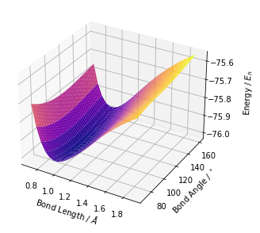

ChemIITools
================

<!-- WARNING: THIS FILE WAS AUTOGENERATED! DO NOT EDIT! -->

Documentation can be found at https://kgrewal1.github.io/ChemIITools/

## Install

``` sh
pip install ChemIITools
```

## How to use

Easily solve the Huckel equation for complex systems

``` python
molecule, energy_dict = Huckel_solve("c1cc2ccc3ccc4ccc5ccc6ccc1c7c2c3c4c5c67")
molecule
```


``` python
MO_plot(energy_dict)
```


Plot potential energy surfaces of symmetric triatomics and find the
vibrational frequencies

``` python
surface_plot(h2o_vals)
```


``` python
r_opt, theta_opt, nu_r, nu_theta = vib_calc(h2o_vals)
print('the optimum bond length of water is ', r_opt, ' angstroms with angle ', theta_opt, ' degrees' )
print('the stretching frequency ', nu_r, ' Hz and bending frequency ', nu_theta, ' Hz' )
```




    the optimum bond length of water is  0.95  angstroms with angle  105.0  degrees
    the stretching frequency  93321760256725.52  Hz and bending frequency  4992.563486679283  Hz
